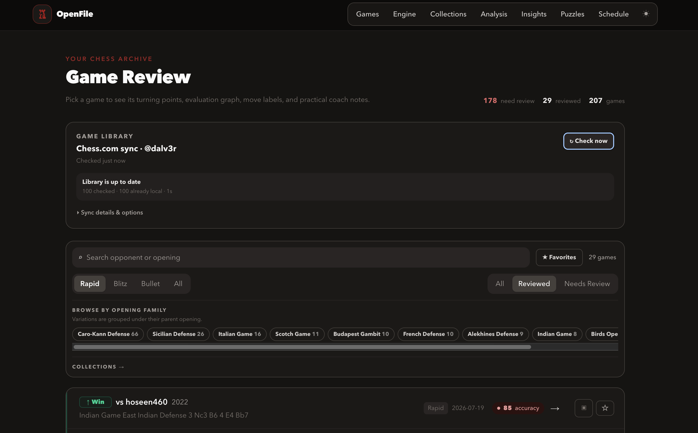
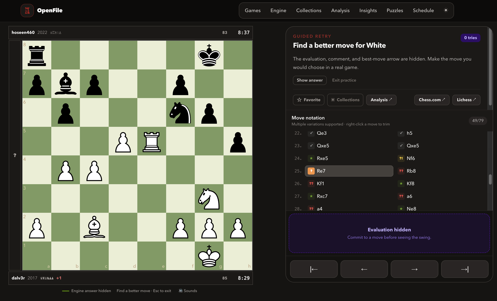
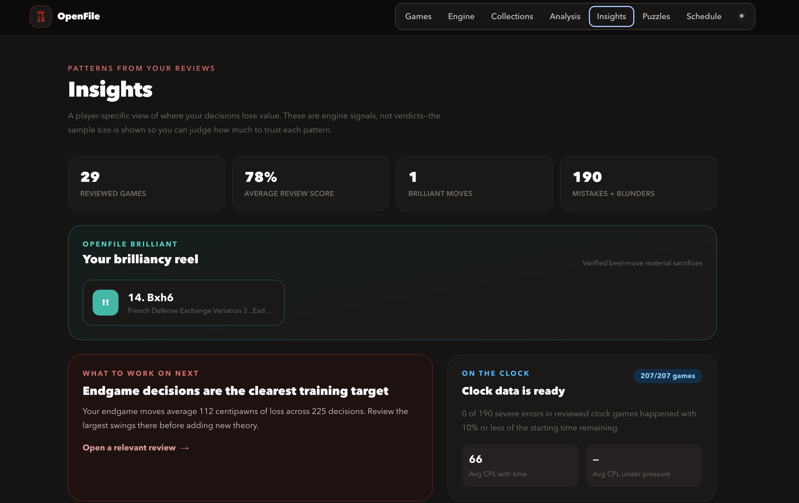

# OpenFile

**A local-first chess review, analysis, and training workspace powered by your
own Stockfish.**

OpenFile turns your Chess.com archive into move-by-move reviews, personal
insights, and reusable training positions. Your games, favorites, collections,
sidelines, puzzles, and engine analysis stay in SQLite on your own computer.



> OpenFile is currently alpha software. Back up your database before testing
> upgrades, and please report setup problems with the output of `openfile doctor`.

## Hosted demo

Try the [live demo](https://open-file-e5vzr4hb7-dalver99s-projects.vercel.app/automation).

The `demo` branch runs without SQLite, Python, Stockfish, or private
configuration. It contains a small sanitized archive snapshot: reviews, graphs,
notation, guided retries, filters, the analysis board, and puzzle solving remain
interactive, while local-only work is clearly disabled or simulated. See the
[demo deployment and data map](docs/DEMO.md) for Vercel setup and the repeatable
snapshot refresh command.

## Main features

- **Game library:** Sync recent Chess.com games or import one game by URL, then
  search and filter by time control, review status, favorites, collections, and
  parent opening family.
- **Local game review:** Analyze games with your installed Stockfish and step
  through natural chess notation, move classifications, coach-style comments,
  best-move arrows, an evaluation bar, and an evaluation graph.
- **Turning-point practice:** Hide the answer and replay mistakes as guided
  retries before revealing the engine recommendation.
- **Analysis workbench:** Explore saved or custom positions, create variation
  trees, draw arrows and square highlights, and configure depth, time, and
  multiple principal variations.
- **Personal insights:** Track accuracy, recurring weaknesses, time-pressure
  patterns, and verified brilliant-move candidates across reviewed games.
- **Puzzles from your games:** Generate and solve local tactical exercises from
  meaningful mistakes instead of working through unrelated positions.
- **Organization:** Favorite games, save sidelines, and build collections for
  openings, tournaments, model games, or anything else you want to revisit.
- **Optional automation and enrichment:** Schedule native background routines
  on macOS, Linux, or Windows, and optionally use Lichess for opening and
  book-move information.
- **Private by default:** SQLite and Stockfish run locally. OpenFile only reaches
  Chess.com's public API and, when enabled, Lichess's opening explorer.

## See it in action

### Turn engine output into useful practice

Review classifications and variations, then enter guided retry mode at a
turning point. The evaluation, explanation, and best move stay hidden until you
commit to a move.



### Find patterns across your games

The Insights page summarizes review scores, severe errors, clock context, and
verified brilliant moves so you can decide what deserves training time next.



## Requirements

- Python 3.10 or newer (3.12 recommended)
- Node.js 22.13 or newer
- Stockfish 16 or newer
- A Chess.com username

On macOS, install Stockfish with `brew install stockfish`. On Windows, extract a
current build from the official Stockfish website; setup can usually find it.

## Guided installation

Each OpenFile command prints what to run next. Start in the repository root.

### 1. Select Python and create the environment

If you use pyenv:

```bash
pyenv install -s 3.12.1
pyenv local 3.12.1
python --version
python -m venv .venv
```

Without pyenv, first confirm `python3 --version` reports 3.10 or newer, then:

```bash
python3 -m venv .venv
```

Next, activate it:

```bash
# macOS / Linux
source .venv/bin/activate

# Windows PowerShell
# .venv\Scripts\Activate.ps1
```

Your prompt should now include `(.venv)`. Continue with step 2.

### 2. Install OpenFile

```bash
python -m pip install --upgrade pip
python -m pip install -e .
```

Next, run `openfile setup`.

### 3. Configure the local services

```bash
openfile setup
```

Setup walks through Chess.com, Stockfish, the optional Lichess token, and the
personal SQLite database. It ends by telling you to run:

```bash
openfile doctor
```

### 4. Verify and launch

When every doctor check is green, it prints these next steps:

```bash
cd webui
npm install
npm run dev
```

Open <http://localhost:3000>, then click **Sync games**. `npm install` is only
needed on the first launch or after web dependencies change. Keep the terminal
running while using OpenFile; press `Ctrl+C` to stop it.

Open **Schedule** in the main navigation when you want OpenFile to sync,
prepare reviews, or prepare puzzles automatically. The web page may be closed
after the native user schedule is installed; the computer must remain awake
and signed in when work runs.

## Daily use

Usually, start the web UI and use its Games page. The equivalent CLI workflow is:

```bash
openfile ingest
openfile select --limit 3
openfile analyze
openfile generate
```

The Games page can also import one of the configured player's Chess.com links,
start its review immediately, and file it in a collection. The CLI equivalent
is:

```bash
openfile import-game --url https://www.chess.com/game/live/123456789
```

Use **Collections** for opening studies, tournaments, or model games. The Games
page groups detailed Chess.com opening names into parent families for filtering,
and the Analysis page includes a position editor with piece placement, side to
move, castling rights, and en-passant state.

Manage or inspect configuration with:

```bash
openfile doctor
openfile config list
openfile config set analysis_depth 14
openfile config set language ko
openfile config path
```

See [Settings](docs/SETTINGS.md) for every parameter, [Commands](PIPELINE_COMMANDS.md)
for batch workflows, [Automation](docs/AUTOMATION.md) for scheduled routines,
and [Architecture](docs/ARCHITECTURE.md) for contributor
boundaries.

## Privacy and compatibility

OpenFile contacts Chess.com's public API and, when configured, Lichess's opening
explorer. SQLite, engine analysis, configuration, and tokens remain local.

The former `rookline` command and Rookline application-data directory remain
supported as compatibility aliases, so upgrading does not hide or replace an
existing database.

## License

AGPL-3.0-only. Improvements remain available to the community.
